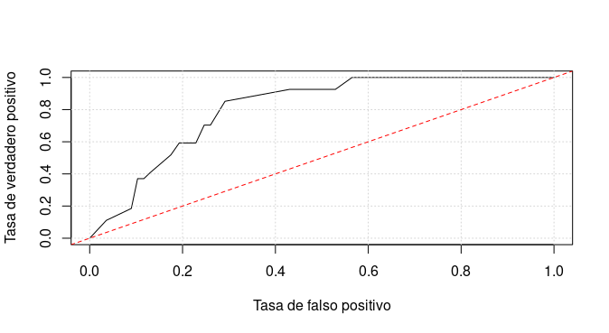

```{r setup, include=FALSE}
knitr::opts_chunk$set(echo = TRUE)
library(knitr)
library(tidyr)
library(plyr)
library(ggplot2)
library(dplyr)
library(treemap)
library(plotrix)
library(corrplot)
library(caret)
library(ROCR)
library(gbm)
```

```{r dataset, echo=FALSE}
  dataset <- read.csv('/home/dimi/Desktop/Austral (2020A)/AyED/CHD predictor/dataset.csv')

porcentajePersonasSinEventoConHTA <- (round(nrow(subset(dataset, Evento==0 & HTA==1)) / nrow(subset(dataset, Evento==0)), digits=4))
porcentajePersonasConEventoConHTA <- (round(nrow(subset(dataset, Evento==1 & HTA==1)) / nrow(subset(dataset, Evento==1)), digits=4))

porcentajePersonasSinEventoConDLP <- (round(nrow(subset(dataset, Evento==0 & DLP==1)) / nrow(subset(dataset, Evento==0)), digits=4))
porcentajePersonasConEventoConDLP <- (round(nrow(subset(dataset, Evento==1 & DLP==1)) / nrow(subset(dataset, Evento==1)), digits=4))

porcentajePersonasSinEventoConTBQ <- (round(nrow(subset(dataset, Evento==0 & TBQ==1)) / nrow(subset(dataset, Evento==0)), digits=4))
porcentajePersonasConEventoConTBQ <- (round(nrow(subset(dataset, Evento==1 & TBQ==1)) / nrow(subset(dataset, Evento==1)), digits=4))

porcentajePersonasSinEventoConOBES <- (round(nrow(subset(dataset, Evento==0 & OBES==1)) / nrow(subset(dataset, Evento==0)), digits=4))
porcentajePersonasConEventoConOBES <- (round(nrow(subset(dataset, Evento==1 & OBES==1)) / nrow(subset(dataset, Evento==1)), digits=4))

porcentajePersonasSinEventoConSCApHR <- (round(nrow(subset(dataset, Evento==0 & SCApHR==1)) / nrow(subset(dataset, Evento==0)), digits=4))
porcentajePersonasConEventoConSCApHR <- (round(nrow(subset(dataset, Evento==1 & SCApHR==1)) / nrow(subset(dataset, Evento==1)), digits=4))

porcentajePersonasSinEventoConDBT <- (round(nrow(subset(dataset, Evento==0 & DBT==1)) / nrow(subset(dataset, Evento==0)), digits=4))
porcentajePersonasConEventoConDBT <- (round(nrow(subset(dataset, Evento==1 & DBT==1)) / nrow(subset(dataset, Evento==1)), digits=4)) 

porcentajePersonasSinEventoConAHF <- (round(nrow(subset(dataset, Evento==0 & AHF==1)) / nrow(subset(dataset, Evento==0)), digits=4))
porcentajePersonasConEventoConAHF <- (round(nrow(subset(dataset, Evento==1 & AHF==1)) / nrow(subset(dataset, Evento==1)), digits=4))

porcentajeMujeresConHTA <- (round(nrow(subset(dataset, Género==0 & HTA==1)) / nrow(subset(dataset, Género==0)), digits=4))
porcentajeHombresConHTA <- (round(nrow(subset(dataset, Género==1 & HTA==1)) / nrow(subset(dataset, Género==1)), digits=4))

porcentajeMujeresConDLP <- (round(nrow(subset(dataset, Género==0 & DLP==1)) / nrow(subset(dataset, Género==0)), digits=4))
porcentajeHombresConDLP <- (round(nrow(subset(dataset, Género==1 & DLP==1)) / nrow(subset(dataset, Género==1)), digits=4))

porcentajeMujeresConTBQ <- (round(nrow(subset(dataset, Género==0 & TBQ==1)) / nrow(subset(dataset, Género==0)), digits=4))
porcentajeHombresConTBQ <- (round(nrow(subset(dataset, Género==1 & TBQ==1)) / nrow(subset(dataset, Género==1)), digits=4))

porcentajeMujeresConOBES <- (round(nrow(subset(dataset, Género==0 & OBES==1)) / nrow(subset(dataset, Género==0)), digits=4))
porcentajeHombresConOBES <- (round(nrow(subset(dataset, Género==1 & OBES==1)) / nrow(subset(dataset, Género==1)), digits=4))

porcentajeMujeresConSCApHR <- (round(nrow(subset(dataset, Género==0 & SCApHR==1)) / nrow(subset(dataset, Género==0)), digits=4))
porcentajeHombresConSCApHR <- (round(nrow(subset(dataset, Género==1 & SCApHR==1)) / nrow(subset(dataset, Género==1)), digits=4))

porcentajeMujeresConDBT <- (round(nrow(subset(dataset, Género==0 & DBT==1)) / nrow(subset(dataset, Género==0)), digits=4))
porcentajeHombresConDBT <- (round(nrow(subset(dataset, Género==1 & DBT==1)) / nrow(subset(dataset, Género==1)), digits=4)) 

porcentajeMujeresConAHF <- (round(nrow(subset(dataset, Género==0 & AHF==1)) / nrow(subset(dataset, Género==0)), digits=4))
porcentajeHombresConAHF <- (round(nrow(subset(dataset, Género==1 & AHF==1)) / nrow(subset(dataset, Género==1)), digits=4))

Mode <- function(x) {
  ux <- unique(x)
  ux[which.max(tabulate(match(x, ux)))]
}
```

# Introducción

<!-- Evitamos utilizar terminología que podrían no entender como "dataset"   -->

La información utilizada para el reporte contiene datos de 1002 pacientes que fueron atendidos en la guardia del Hospital Universitario Austral. Algunos fueron internados y otros se los hizo esperar, información correspondiente al dato “Evento”.

Esta información está compuesta por 19 datos de cada uno de los pacientes, más el dato "Evento", para un total de 20 datos (llamados "variables") por paciente.

A continuación se presenta un análisis progresivo de la información. Primero se realiza un análisis univariable, luego bivariable y por último multivariable. Al finalizar esta etapa se procede a la construcción de un modelo matemático para la predicción de eventos en pacientes.

<!-- Mejorar esta parte, "manipular" suena algo negativo, alabar el dataset -->
<!-- Los datos no se manipularon de ninguna manera al realizar el análisis. El conjunto de datos proporcionado está completo, es decir, no posee algún dato faltante. -->

# Análisis

## Análisis univariable

### Factores de riesgo

<table class='table'>
<tr>
<td>
```{r graf factores, echo=FALSE}
theme_set(theme_minimal())

factoresDeRiesgo <- data.frame(Estado = c("Sin Evento", "Con Evento"),
                 HTA = c(porcentajePersonasSinEventoConHTA, porcentajePersonasConEventoConHTA),
                 DLP = c(porcentajePersonasSinEventoConDLP, porcentajePersonasConEventoConDLP),
                 TBQ = c(porcentajePersonasSinEventoConTBQ, porcentajePersonasConEventoConTBQ),
                 OBES = c(porcentajePersonasSinEventoConOBES, porcentajePersonasConEventoConOBES),
                 SCApHR = c(porcentajePersonasSinEventoConSCApHR, porcentajePersonasConEventoConSCApHR),
                 DBT = c(porcentajePersonasSinEventoConDBT, porcentajePersonasConEventoConDBT),
                 AHF = c(porcentajePersonasSinEventoConAHF, porcentajePersonasConEventoConAHF))

FDRtall <- factoresDeRiesgo %>% gather(key = Factores, value = Porcentaje, HTA:AHF)

ggplot(FDRtall, aes(Factores, Porcentaje, fill = Estado)) + 
  geom_col(position = "dodge", colour="black") +
  theme(plot.background = element_rect(fill = "white"), axis.title.y=element_blank(), axis.title.x=element_blank()) +
  scale_y_continuous(labels = scales::percent)
```
</td>
<td>
| Variable  | Significado                                |
|-----------|--------------------------------------------|
| AHF       | Antecedentes familiares                    |
| DBT       | Diabetes                                   |
| DLP       | Dislipemia                                 |
| HTA       | Hipertensión arterial                      |
| OBES      | Obesidad                                   |
| SCApHR    | Historia de revascularización              |
| TBQ       | Tabaquismo                                 |
</td>
<tr>
</table>

Se puede observar como **hay mayor presencia de los factores de riesgo en quienes sufrieron eventos**. En el caso de la hipertensión arterial y la dislipemia, más de la mitad de las personas que sufrieron un evento poseen uno de estos factores. 

### Edad
```{r graf edad, echo=FALSE, fig.align = 'center'}
theme_set(theme_minimal())

personas <- data.frame(evento = factor(dataset$Evento), Edad=dataset$Edad)
m <- ddply(personas, "evento", summarise, mode=Mode(Edad))
    ggplot(personas, aes(x=Edad, fill=evento)) + 
      geom_density(alpha=0.4) +
      geom_vline(data=m, aes(xintercept=mode, color=evento), linetype="dashed", alpha=1, show.legend = FALSE) + 
      theme(plot.title=element_text(hjust = 0.5), plot.background=element_rect(fill = "white"), axis.title.y=element_blank()) +
      scale_fill_manual(name = "Estado", labels=c("Con Evento", "Sin Evento"), values=c("#F8766D", "#00BFC4")) +
      # scale_color_manual(values=c("#00BFC4", "#F8766D"), labels=c("Media sin evento", "Media con evento"), name=NULL) +
      # scale_linetype_discrete(labels=c("Media sin evento", "Media con evento"), name=NULL) 
      # guides(fill = guide_legend(reverse = TRUE)) +
      scale_y_continuous(labels = scales::percent)
    
```

<!-- Evitamos usar el término "moda" -->

Las lineas punteadas señalan las edades más frecuentes de cada grupo. **En el grupo de quienes sufrieron eventos, la edad más frecuente es de 66 años, mientras que en el grupo de personas sin eventos es de 47 años**. 

### Género
En el conjunto de datos hay 595 hombres y 407 mujeres, esto quiere decir que está compuesto por 59% hombres y 41% mujeres.

```{r graf genero, echo=FALSE, fig.align = 'center'}
porcentajeHombresConEvento <- nrow(subset(dataset, Evento==1 & Género==1))/nrow(subset(dataset, Género==1))
porcentajeHombresSinEvento <- nrow(subset(dataset, Evento==0 & Género==1))/nrow(subset(dataset, Género==1))
porcentajeMujeresConEvento <- nrow(subset(dataset, Evento==1 & Género==0))/nrow(subset(dataset, Género==0))
porcentajeMujeresSinEvento <- nrow(subset(dataset, Evento==0 & Género==0))/nrow(subset(dataset, Género==0))

theme_set(theme_minimal())

factoresDeRiesgo <- data.frame(Estado = c("Con Evento", "Sin Evento"),
                               Hombre = c(porcentajeHombresConEvento, porcentajeHombresSinEvento),
                               Mujer = c(porcentajeMujeresConEvento, porcentajeMujeresSinEvento))

FDRtall <- factoresDeRiesgo %>% gather(key = Género, value = Porcentaje, Hombre:Mujer)

ggplot(FDRtall, aes(Género, Porcentaje, fill = Estado)) +
  geom_col(position = "fill", colour="black", width=0.5) +
  theme(plot.background = element_rect(fill = "white"), axis.title.x=element_blank(), axis.title.y=element_blank()) +
  scale_y_continuous(labels = scales::percent)
```
    
El 16% de los hombres y el 6% de las mujeres sufrieton eventos. <!-- **Los hombres sufrieron más eventos que las mujeres** -->
    
    
## Análisis bivariable


### Hipertensión y dislipemia {.tabset .tabset-fade #HTA-DLP-tabs}

De los 1002 pacientes del conjunto de datos, hay 329 personas (33%) con hipertensión arterial y 279 personas (28%) con dislipemia. Separando los 1002 pacientes en quienes sufrieron eventos y en quienes no, tenemos: 

#### Con eventos {- .unnumbered}
```{r graphConEventosHTAyDLP, echo=FALSE}
percentage <- c(round(100 * nrow(subset(dataset, Evento==1 & HTA==1 & DLP==1)) / nrow(subset(dataset, Evento==1)), 0),
                round(100 * nrow(subset(dataset, Evento==1 & HTA==1 & DLP==0)) / nrow(subset(dataset, Evento==1)), 0),
                round(100 * nrow(subset(dataset, Evento==1 & HTA==0 & DLP==1)) / nrow(subset(dataset, Evento==1)), 0),
                round(100 * nrow(subset(dataset, Evento==1 & HTA==0 & DLP==0)) / nrow(subset(dataset, Evento==1)), 0))
value <- c(nrow(subset(dataset, Evento==1 & HTA==1 & DLP==1)), 
           nrow(subset(dataset, Evento==1 & HTA==1 & DLP==0)),
           nrow(subset(dataset, Evento==1 & HTA==0 & DLP==1)),
           nrow(subset(dataset, Evento==1 & HTA==0 & DLP==0)))
group <- c(paste("Hipertensos con dislipemia: ",    value[1], " (", percentage[1], "%)", sep="" ),
           paste("Hipertensos sin dislipemia: ",    value[2], " (", percentage[2], "%)", sep="" ),
           paste("No hipertensos con dislipemia: ", value[3], " (", percentage[3], "%)", sep="" ),
           paste("No hipertensos sin dislipemia: ", value[4], " (", percentage[4], "%)", sep="" ))
data <- data.frame(group,value)
treemap(data,
        index="group",
        palette = "BuGn",
        vSize="value",
        title="",
        type="index",
        border.lwds = c(2,2)
)
```

#### Sin eventos {- .unnumbered}
```{r graphSinEventosHTAyDLP, echo=FALSE}
percentage <- c(round(100 * nrow(subset(dataset, Evento==0 & HTA==1 & DLP==1)) / nrow(subset(dataset, Evento==0)), 0),
                round(100 * nrow(subset(dataset, Evento==0 & HTA==1 & DLP==0)) / nrow(subset(dataset, Evento==0)), 0),
                round(100 * nrow(subset(dataset, Evento==0 & HTA==0 & DLP==1)) / nrow(subset(dataset, Evento==0)), 0),
                round(100 * nrow(subset(dataset, Evento==0 & HTA==0 & DLP==0)) / nrow(subset(dataset, Evento==0)), 0))
value <- c(nrow(subset(dataset, Evento==0 & HTA==1 & DLP==1)), 
           nrow(subset(dataset, Evento==0 & HTA==1 & DLP==0)),
           nrow(subset(dataset, Evento==0 & HTA==0 & DLP==1)),
           nrow(subset(dataset, Evento==0 & HTA==0 & DLP==0)))
group <- c(paste("Hipertensos con dislipemia:",    value[1], " (", percentage[1], "%)", sep=""  ),
           paste("Hipertensos sin dislipemia:",    value[2], " (", percentage[2], "%)", sep=""  ),
           paste("No hipertensos con dislipemia:", value[3], " (", percentage[3], "%)", sep=""  ),
           paste("No hipertensos sin dislipemia:", value[4], " (", percentage[4], "%)", sep=""  ))
data <- data.frame(group,value)
treemap(data,
        index="group",
        palette = "BuGn",
        vSize="value",
        title="",
        type="index",
        border.lwds = c(2,2)
)
```

<script>
  $(document).ready(function() {
    $('#HTA-DLP-div').appendTo('#HTA-DLP-tabs');
  });
</script>

<div id="HTA-DLP-div">

  Se puede observar como en el grupo de quienes sufrieron un evento, la mayoría de las personas son hipertensos con dislipemia, siendo casi el doble de quienes no poseen ambos factores. En cambio, en el grupo de quienes no sufrieron un evento, más de la mitad de las personas no tienen ninguno de estos dos factores.

  **Las personas hipertensas que presentan dislipemia tienen 18 veces más probabilidad de sufrir un evento, mientras que las personas no hipertensas con dislipemia tienen 2.5 veces más probabilidad de sufrir un evento**. [Ariyanti y Besral (2019)](https://www.ncbi.nlm.nih.gov/pmc/articles/PMC6515015/). Los porcentajes de personas con dislipemia en ambos grupos, concuerda con los porcentajes de los grupos del paper. 
</div>

#### {.unnumbered}


### Género y edad {.tabset .tabset-fade #Gen-Edad-tabs}

#### Con eventos {- .unnumbered}
```{r graphConEventosGenero, echo=FALSE}
    conEvento <- data.frame(género = factor(subset(dataset, Evento==1)$Género), Edad=subset(dataset, Evento==1)$Edad)
    m <- ddply(conEvento, "género", summarise, mode=Mode(Edad))
    ggplot(conEvento, aes(x=Edad, fill=género)) + 
      geom_density(alpha=0.4) +
      geom_vline(data=m, aes(xintercept=mode, color=género), linetype="dashed", alpha=1, show.legend = FALSE) +
      theme(plot.title = element_text(hjust = 0.5), plot.background=element_rect(fill="white"), axis.title.y=element_blank()) +
      scale_fill_manual(name = "Género", labels=c("Mujer", "Hombre"), values=c("#F8766D", "#00BFC4")) +
      scale_y_continuous(labels = scales::percent)
      # scale_color_manual(values=c("#F8766D", "#00BFC4"), labels=c("Moda mujer", "Moda hombre"), name=NULL) +
      # scale_linetype_discrete(labels=c("Moda mujer", "Moda hombre"), name=NULL) +
      # guides(fill = guide_legend(order = 1)) +
```

<!-- Revisar el tema de la grafica de mujeres, parece que hay una subpoblacion en el primer grupo que consta de mujeres mas jovenes que tienen eventos. Ver a que se debe esto, buscar entre los factores de riesgo cuales predominan en esta subpoblacion. -->

#### Sin eventos {- .unnumbered}
```{r graphSinEventosGenero, echo=FALSE}
sinEvento <- data.frame(género = factor(subset(dataset, Evento==0)$Género), Edad=subset(dataset, Evento==0)$Edad)
    m <- ddply(sinEvento, "género", summarise, mode=Mode(Edad))
    ggplot(data=sinEvento, aes(x=Edad, fill=género)) + 
      geom_density(alpha=0.4) +
      geom_vline(data=m, aes(xintercept=mode, color=género), linetype="dashed", alpha=1, show.legend = FALSE) +
      theme(plot.title = element_text(hjust = 0.5), plot.background=element_rect(fill="white"), axis.title.y=element_blank()) +
      scale_fill_manual(name = "Género", labels=c("Mujer", "Hombre"), values=c("#F8766D", "#00BFC4")) +
      scale_y_continuous(labels = scales::percent)
      # scale_color_manual(values=c("#F8766D", "#00BFC4"), labels=c("Moda mujer", "Moda hombre"), name=NULL) +
      # scale_linetype_discrete(labels=c("Moda mujer", "Moda hombre"), name=NULL) +
      # guides(fill = guide_legend(order = 1))
```
  
<script>
  $(document).ready(function() {
    $('#Gen-Edad-div').appendTo('#Gen-Edad-tabs');
  });
</script>

<div id="Gen-Edad-div">

En el grupo de personas que sufrieron  eventos, la edad más frecuente en las mujeres es de 70 años, mientras que en los hombres es de 66 años.

Se puede observar como en la curva de las mujeres hay un "pico" más pequeño antes del principal, centrado entre los 49-50 años. Este "pico" se debe a 4 mujeres con edades entre 48 y 50 años, las cuales sufrieron eventos. Los factores que todas tuvieron en común fueron:

* Presentaron dolor actual (PDA)
* El dolor no reproducía palpación (RP)
* El dolor no era igual al de un evento previo (MDEP)
* No eran diabéticas (DBT)
* No tenían antecedentes familaires (AHF)

En el grupo de personas sin eventos, la edad más frecuente en las mujeres es de 39 años, mientras que en los hombres es de 48 años.
</div>
  
#### {.unnumbered}


### Obesidad y dislipemia {.tabset .tabset-fade #OBES-DLP-tabs}

#### Con eventos {- .unnumbered}
```{r graphConEventosOBESyDLP, echo=FALSE}
percentage <- c(round(100 * nrow(subset(dataset, Evento==1 & OBES==1 & DLP==1)) / nrow(subset(dataset, Evento==1)), 0),
                round(100 * nrow(subset(dataset, Evento==1 & OBES==1 & DLP==0)) / nrow(subset(dataset, Evento==1)), 0),
                round(100 * nrow(subset(dataset, Evento==1 & OBES==0 & DLP==1)) / nrow(subset(dataset, Evento==1)), 0),
                round(100 * nrow(subset(dataset, Evento==1 & OBES==0 & DLP==0)) / nrow(subset(dataset, Evento==1)), 0))
value <- c(nrow(subset(dataset, Evento==1 & OBES==1 & DLP==1)), 
           nrow(subset(dataset, Evento==1 & OBES==1 & DLP==0)),
           nrow(subset(dataset, Evento==1 & OBES==0 & DLP==1)),
           nrow(subset(dataset, Evento==1 & OBES==0 & DLP==0)))
group <- c(paste("Obesos con dislipemia: ",    value[1], " (", percentage[1], "%)", sep=""  ),
           paste("Obesos sin dislipemia: ",    value[2], " (", percentage[2], "%)", sep=""  ),
           paste("No obesos con dislipemia: ", value[3], " (", percentage[3], "%)", sep=""  ),
           paste("No obesos sin dislipemia: ", value[4], " (", percentage[4], "%)", sep=""  )) 
data <- data.frame(group,value)
treemap(data,
        index="group",
        palette = "BuGn",
        vSize="value",
        title="",
        type="index",
        border.lwds = c(2,2)
)
```

#### Sin eventos {- .unnumbered}
```{r graphSinEventosOBESyBLP, echo=FALSE}
percentage <- c(round(100 * nrow(subset(dataset, Evento==0 & OBES==1 & DLP==1)) / nrow(subset(dataset, Evento==0)), 0),
                round(100 * nrow(subset(dataset, Evento==0 & OBES==1 & DLP==0)) / nrow(subset(dataset, Evento==0)), 0),
                round(100 * nrow(subset(dataset, Evento==0 & OBES==0 & DLP==1)) / nrow(subset(dataset, Evento==0)), 0),
                round(100 * nrow(subset(dataset, Evento==0 & OBES==0 & DLP==0)) / nrow(subset(dataset, Evento==0)), 0))
value <- c(nrow(subset(dataset, Evento==0 & OBES==1 & DLP==1)), 
           nrow(subset(dataset, Evento==0 & OBES==1 & DLP==0)),
           nrow(subset(dataset, Evento==0 & OBES==0 & DLP==1)),
           nrow(subset(dataset, Evento==0 & OBES==0 & DLP==0)))
group <- c(paste("Obesos con dislipemia: ",    value[1], " (", percentage[1], "%)", sep=""  ),
           paste("Obesos sin dislipemia: ",    value[2], " (", percentage[2], "%)", sep=""  ),
           paste("No obesos con dislipemia: ", value[3], " (", percentage[3], "%)", sep=""  ),
           paste("No obesos sin dislipemia: ", value[4], " (", percentage[4], "%)", sep=""  )) 
data <- data.frame(group,value)
treemap(data,
        index="group",
        palette = "BuGn",
        vSize="value",
        title="",
        type="index",
        border.lwds = c(2,2)
)
```

#### {.unnumbered}

<script>
  $(document).ready(function() {
    $('#OBES-DLP-div').appendTo('#OBES-DLP-tabs');
  });
</script>

<div id="OBES-DLP-div">
  En el grupo de quienes no sufrieron eventos **dos tercios son personas sin obesidad ni dislipemia**. También se puede observar una desigualdad en la cantidad de personas que si tuvieron ambos factores de riesgo (82) y quienes no (590), claramente a favor de quienes no los poseen. 
  
  En el otro grupo (quienes si sufrieron eventos) también hay una diferencia en esta cantidad, pero en este caso hay más personas obesas con dislipemia y la cantidad es más semejante (37 y 33).
  
  Al realizar una prueba de chi cuadrado de Pearson y calculando el coeficiente de correlación entre ambas variables, **se concluye con que existe una asociación positiva entre ellas**. Esto quiere decir que sus valores se mueven en la misma dirección. Al disminuir una, la otra disminuye y al aumentar una, la otra aumenta.
  
  <script language="javascript"> 
    function toggle(num) {
      var ele = document.getElementById("toggleText" + num);
      var text = document.getElementById("displayText" + num);
      if(ele.style.display == "block") {
        ele.style.display = "none";
        text.innerHTML = "show";
      }
      else {
        ele.style.display = "block";
        text.innerHTML = "hide";
      }
   } 
  </script>
  
  <a id="displayText" href="javascript:toggle(1);">Resultados de la prueba</a>
  <div id="toggleText1" style="display: none">
  ```{r, echo=FALSE, collapse=TRUE}
  PersonasConDislipemiaYObesidad <- table(dataset$DLP, dataset$OBES, dnn=c("DLP", "OBES"))
  cat("PersonasConDislipemiaYObesidad:")
  PersonasConDislipemiaYObesidad
  chisq.test(PersonasConDislipemiaYObesidad)
  coef <- format(round(cor(dataset$OBES, dataset$DLP), 3), nsmall=3)
  cat("\nCoeficiente de correlación:", coef)
  ```
  </div>
  
</div>


## Análisis multivariable


### Hipertensión, dislipemia y tabaquismo

```{r graph HTA, DLP y TBQ, echo=FALSE}
conEvento <- subset(dataset, Evento==1) %>% count(HTA, DLP, TBQ)
sinEvento <- subset(dataset, Evento==0) %>% count(HTA, DLP, TBQ)

porcentajeConEventoCon0Factores <- conEvento$n[1] / sum(conEvento$n)
porcentajeConEventoCon1Factores <- (conEvento$n[2] + conEvento$n[3] + conEvento$n[5]) / sum(conEvento$n)
porcentajeConEventoCon2Factores <- (conEvento$n[4] + conEvento$n[6] + conEvento$n[7]) / sum(conEvento$n)
porcentajeConEventoCon3Factores <- conEvento$n[8] / sum(conEvento$n)

porcentajeSinEventoCon0Factores <- sinEvento$n[1] / sum(sinEvento$n)
porcentajeSinEventoCon1Factores <- (sinEvento$n[2] + sinEvento$n[3] + sinEvento$n[5]) / sum(sinEvento$n)
porcentajeSinEventoCon2Factores <- (sinEvento$n[4] + sinEvento$n[6] + sinEvento$n[7]) / sum(sinEvento$n)
porcentajeSinEventoCon3Factores <- sinEvento$n[8] / sum(sinEvento$n)

theme_set(theme_minimal())

datos <- data.frame(Factores = c("0", "1", "2", "3"),
                 ConEvento = c(porcentajeConEventoCon0Factores,
                               porcentajeConEventoCon1Factores,
                               porcentajeConEventoCon2Factores,
                               porcentajeConEventoCon3Factores),
                 SinEvento = c(porcentajeSinEventoCon0Factores,
                               porcentajeSinEventoCon1Factores,
                               porcentajeSinEventoCon2Factores,
                               porcentajeSinEventoCon3Factores))

data <- datos %>% gather(key = Eventualidad, value = Porcentaje, ConEvento:SinEvento)

ggplot(data, aes(Eventualidad, Porcentaje, fill = Factores)) +
  geom_col(position = "fill", colour="black", width=0.5) +
  theme(plot.background = element_rect(fill = "white"), axis.title.x=element_blank(), axis.title.y=element_blank()) +
  scale_y_continuous(labels = scales::percent)
```
  
  **De 8069 adultos estadounidenses que fallecieron por un evento, nueve de cada diez tuvieron al menos uno de estos tres factores de riesgo**. [Mensah, Brown, Croft y Greenlund (2005)](https://www.researchgate.net/profile/David_Brown37/publication/278192232_Major_coronary_risk_factors_and_death_from_coronary_heart_disease_-_Baseline_and_follow-up_mortality_health_and_nutrition_examination_data_from_the_second_national_survey_NHANES_II/links/5b4115dcaca2728a0d618972/Major-coronary-risk-factors-and-death-from-coronary-heart-disease-Baseline-and-follow-up-mortality-health-and-nutrition-examination-data-from-the-second-national-survey-NHANES-II.pdf). 
  
  En los pacientes que tuvieron un evento, 106 (88%) tuvieron al menos uno de estos factores de riesgo y la mayoría (`r paste(round(100*porcentajeConEventoCon2Factores, 0), "%", sep="")`) tuvo dos de los tres factores de riesgo.
  
  En los pacientes que no tuvieron un evento, 416 (47%) tuvieron al menos uno de estos factores de riesgo y la mayoría (`r paste(round(100*porcentajeSinEventoCon0Factores), "%", sep="")`) tuvo cero de los tres factores de riesgo.

### Hipertensión, dislipemia y revascularización 
```{r graph HTA, DLP y SCApHR, echo=FALSE}
porcentajeConEventoConCondiciones <- nrow(subset(dataset, Evento==1 & HTA==1 & DLP==1 & SCApHR==1))/nrow(subset(dataset, Evento==1))
porcentajeConEventoSinCondiciones <- nrow(subset(dataset, Evento==1 & HTA==0 & DLP==0 & SCApHR==0))/nrow(subset(dataset, Evento==1))
porcentajeSinEventoConCondiciones <- nrow(subset(dataset, Evento==0 & HTA==1 & DLP==1 & SCApHR==1))/nrow(subset(dataset, Evento==0))
porcentajeSinEventoSinCondiciones <- nrow(subset(dataset, Evento==0 & HTA==0 & DLP==0 & SCApHR==0))/nrow(subset(dataset, Evento==0))

theme_set(theme_minimal())

datos <- data.frame(Condición = c("No hipertensos, sin dislipemia y sin revascularización", "Hipertensos, con dislipemia y revascularización"),
                 SinEvento = c(porcentajeSinEventoSinCondiciones, porcentajeSinEventoConCondiciones),
                 ConEvento = c(porcentajeConEventoSinCondiciones, porcentajeConEventoConCondiciones))

data <- datos %>% gather(key = Eventualidad, value = Porcentaje, ConEvento:SinEvento)

ggplot(data, aes(Eventualidad, Porcentaje, fill = Condición)) +
  geom_col(position = "dodge", colour="black", width=0.5) +
  theme(plot.background = element_rect(fill = "white"), axis.title.x=element_blank(), axis.title.y=element_blank()) +
  scale_y_continuous(labels = scales::percent)
```

El 25% de quienes sufrieron un evento tienen hipertensión arterial, dislipemia e historia de revascularización. Mientras que en el grupo de quienes no sufrieron un evento, el 7% tienen estos tres factores de riesgo a la vez.

En el grupo de quienes sufrieron eventos el 20% no tiene ninguno de estos factores, mientras que en el grupo de quienes no sufrieron eventos, el 57% no tiene ninguno de estos factores.

**Más de la mitad de quienes no sufrieron eventos no tienen hipertensión, dislipemia ni historia de revascularización. Un cuarto de quienes si sufrieron eventos poseen los tres factores de riesgo a la vez.**

### Matriz de correlación

A continuación presentamos una matriz de correlación de las 19 variables, en ella se puede observar la relación que hay entre pares de variables.

Se puede ver que hay cierta relación entre los factores de riesgo. También entre la edad y la historia de revascularizacón (SCApHR) con los factores de riesgo. 

<center>
<table class='corrplot'>
<tr>
<td text-align="center">
```{r graph corrplot, echo=FALSE, fig.height=7}
  corr_mat=cor(dataset, method="s")
  corrplot(corr_mat, method="color", tl.col = "black") 
```
</td>
</tr>
</table>
</center>

# Predictor

## Selección de variables

Para el desarrollo del modelo predictivo es necesario seleccionar las variables a utilizar. Hay variables que, para nuestro objetivo, son más relevantes que otras. Además, no sería práctico hacerle demasiadas preguntas al paciente en la guardia.

En un primer lugar, para la selección de las variables se utiliza una herramienta que proporciona el lenguaje de programación R. Esta herramienta, llamada CARET (**C**lassification **A**nd **RE**gression **T**raining), posee varias funciones para generar distintos tipo de modelos y es utilizada extensamente en el ámbito científico.

Building Predictive Models in R Using the caret Package.
[Kuhn (2008)](https://www.jstatsoft.org/article/view/v028i05)

A Proposed Data Analytics Workflow and Example Using the R Caret Package.
[Jones et al (2018)](http://matthewalanham.com/Students/2018_MWDSI_R%20caret%20paper.pdf)

De todas las variables independientes del conjunto de datos (la variable Evento sería dependiente, la que se desea predecir), la herramienta CARET sugiere utilizar las siguientes:

<!-- Recursive feature selection -->

<!-- Outer resampling method: Cross-Validated (10 fold, repeated 3 times)  -->

<!-- Resampling performance over subset size: -->

<!--  Variables   RMSE Rsquared    MAE  RMSESD RsquaredSD   MAESD Selected -->
<!--          4 0.3093   0.1328 0.1979 0.03791    0.06909 0.02683          -->
<!--          8 0.3099   0.1311 0.1882 0.03641    0.06897 0.02770          -->
<!--         16 0.2990   0.1869 0.1797 0.03439    0.07286 0.02694          -->
<!--         19 0.2979   0.1924 0.1806 0.03411    0.07811 0.02676        * -->

<!-- The top 5 variables (out of 19): -->

<center>
| Edad | Antecedentes familiares | Tabaquismo | Obesidad | Dislipemia |
|-|-|-|-|-| 
<!-- | Variable | Significado                                | -->
<!-- |----------|--------------------------------------------| -->
<!-- | Edad     | Edad                                       | -->
<!-- | AHF      | Antecedentes familiares                    | -->
<!-- | TBQ      | Tabaquismo                                 | -->
<!-- | OBES     | Obesidad                                   | -->
<!-- | DLP      | Dislipemia                                 | -->
</center>
<p class="bottom-space">
</p>
 
Pero se puede ver como en ese listado no están presentes algunas variables que, en el análisis de datos realizado en la sección anterior, son relevantes. Como la hipertensión arterial (HTA), la diábetes (DBT) y la historia de revascularización (SCApHR).

Por lo tanto, aún cuando la herramienta CARET participa en el momento de seleccionar variables, también se utiliza la información obtenido del análisis de datos.

## Modelo

  Por lo tanto, se utilizan las siguientes variables
  
<center>
| Hipertensión arterial | Dislipemia | Tabaquismo | Obesidad |
|-|-|-|-|-|
</center>

<p class="bottom-space">
</p>

  El modelo estadístico utilizado se basa en una regresión logística.

  Para el modelo se realiza un análisis de regresión logístico.

### Importancia de las variables

<center>
<table>
<tr>
<td>

</td>
</tr>
</table>
</center>

<p class="bottom-space">
</p>

Para el modelo la variable más importante es la hipertensión arterial, seguido de la dislipemia, el tabaquismo y la obesidad.

### Curva AUROC

<center>
<table>
<tr>
<td>

</td>
</tr>
</table>
</center>

<p class="bottom-space">
</p>

El valor de la curva AUROC es de 0.806